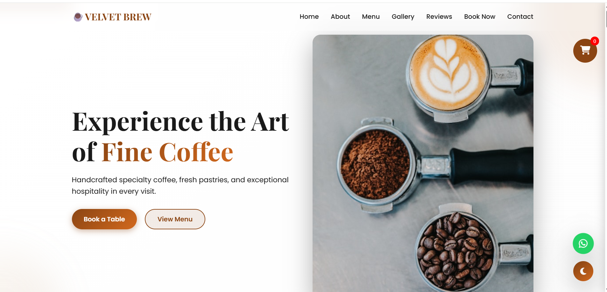
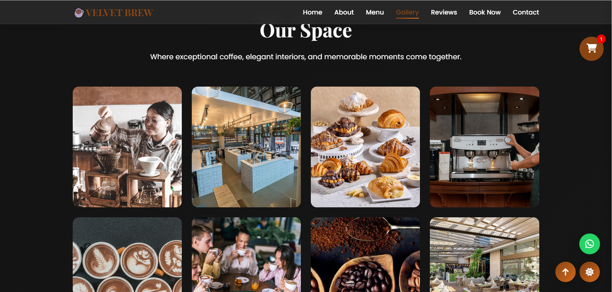

# ☕ Velvet Brew Café 

## 📖 Overview

Velvet Brew Café is a modern, responsive café website designed to provide customers with an engaging online experience. The website showcases premium coffee, artisan pastries, an elegant gallery, customer reviews, online table booking, and an interactive shopping cart. Built using HTML, CSS, and JavaScript, the project focuses on creating a visually appealing and user-friendly interface.

## 🏠 Home Page



## 📌 Features
* ☕ Premium Coffee & Beverage Menu
* 🥐 Fresh Pastries & Desserts
* 🛒 Shopping Cart Functionality
* 🌙 Dark & Light Theme Toggle
* 🖼️ Interactive Gallery
* ⭐ Customer Reviews Section
* 📅 Online Table Booking
* 📍 Contact Information
* 📱 Fully Responsive Design
* ✨ Smooth Scrolling & Animations

## 📸 Gallery Preview



## 🛠️ Technologies Used
### Frontend
* HTML5
* CSS3
* JavaScript (ES6)
### Libraries & Resources
* Font Awesome
* Google Fonts
## 📂 Website Sections
* 🏠 Home
* ℹ️ About
* ☕ Menu
* 🖼️ Gallery
* ⭐ Reviews
* 📅 Book Now
* 📞 Contact
* 🛒 Shopping Cart

## 📂 Project Structure

```text
Velvet-Brew/
│
├── index.html
├── css/
│   ├── style.css
│   └── responsive.css
│
├── js/
│   └── script.js
│
├── images/
│   ├── homepage-preview.png
│   ├── gallery-preview.png
│   ├── coffee/
│   ├── pastries/
│   ├── gallery/
│   ├── icons/
│   └── logo.png
│
├── README.md
└── .gitignore
```
## 💡 About the Project
Velvet Brew Café was developed as a front-end web development project to demonstrate modern UI/UX principles and responsive web design. The website provides an attractive digital presence for a café, allowing users to explore the menu, browse the gallery, read customer reviews, book tables, and manage selected menu items through an interactive shopping cart.

## 🎯 Objectives
* Build a modern responsive website
* Practice HTML, CSS, and JavaScript
* Create an attractive user interface
* Implement Dark & Light Theme Switching
* Design an interactive shopping experience
* Improve UI/UX design skills

## 📚 Learning Outcomes
* Responsive Web Design
* HTML5 Semantic Elements
* CSS Flexbox & Grid
* JavaScript DOM Manipulation
* Theme Toggle Implementation
* Shopping Cart Functionality
* Smooth Scrolling & Animations
* User Interface Design
## ▶️ How to Run
### Clone the repository
```bash
git clone https://github.com/your-username/velvet-brew.git
cd velvet-brew
```
### Run the Project
Simply open the `index.html` file in your preferred web browser.
Or, if you're using VS Code:
1. Install the **Live Server** extension.
2. Right-click on `index.html`.
3. Select **Open with Live Server**.

## 👩‍💻 Author
**Jangili Sandhya**
* 🎓 B.Tech Computer Science Student
* 🌐 Front-End & Full Stack Developer
* 🐍 Python Developer
* 🤖 AI/ML Enthusiast
### Connect With Me
* **LinkedIn:** https://www.linkedin.com/in/jangili-sandhya
* **GitHub:** https://github.com/jangilisandhya

⭐ Thank you for visiting my **Velvet Brew Café** project repository! 
